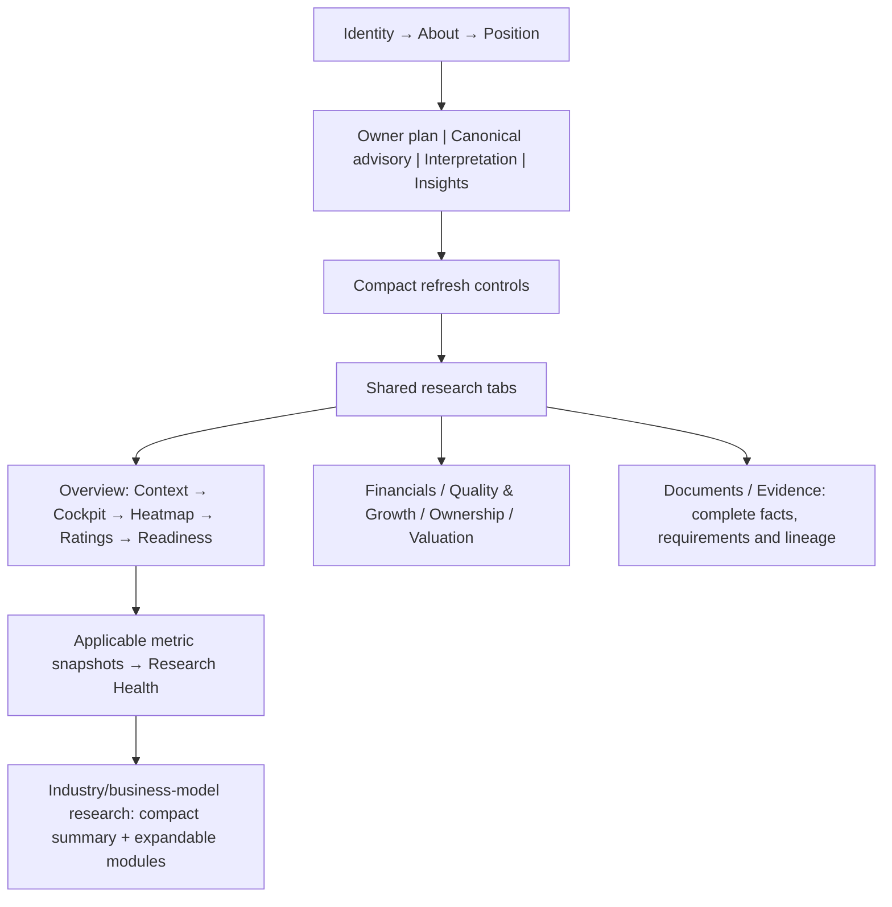

# PortfolioAI Stock Research Page Design and Implementation Plan

**Date:** 6 October 2026 (Asia/Kolkata)
**Repository:** drddutta-portfolio/PortfiolioAI
**Target branch:** PortfolioAI-Development
**Design version:** STOCK_RESEARCH_WORKSPACE_V2_3_INDUSTRY_FIRST_TWO_PART_DESIGN
**Status:** Consolidated design specification / implementation proposal. Documentation creation is authorized; this document does not independently authorize application changes, provider execution, migrations or later V1 gates.
**Reference baseline:** `95ae01330f87e7adc35a79da084f4beb9157c2bd`
**Product rule:** One PortfolioAI, one reusable stock Research shell, profile-specific research within it.

## 1. Purpose and boundaries

Make every stock Research page understandable, consistent and useful while preserving the frozen R4M shell, existing methodology, canonical authorities and all retained evidence. The first screen and the beginning of Overview must explain the company, the owner's exposure, what research is established, and why any conclusion is unavailable.

This document consolidates PortfolioAI sources only. No design, code, taxonomy or methodology from another program is incorporated.

This is an upgrade of the existing Research workspace, not a replacement application. It changes presentation contracts and implementation planning; it does not approve scoring formulas, source substitutions or methodology assignments. Implementation must remain subordinate to the Master Blueprint, Research and Intelligence Architecture, Single Source of Truth Architecture, Database Architecture, Development Rules, current Scope Freeze A/B and explicit gate authorization.

## 2. Source references and their authority

| Reference | Recorded status and contribution | How this plan uses it |
|---|---|---|
| [R4M Universal Research Workspace Freeze](R4M_Universal_Research_Workspace_Freeze.md) | Frozen R4M_V1; records owner-approved PR #100 merged at de54ed1fa9569e9db0c14cfa8dac6dfbc2638c9f. Defines common regions, tabs, interfaces and prohibited extensions. | Governs the shared shell and state vocabulary. Its existing freeze is preserved. |
| [R4M Profile-Driven Research Workspace Plan](R4M_Profile_Driven_Research_Workspace_Plan.md) | Records a reusable workspace, profile UI registry, compact summaries, responsive presentation and regression requirements. | Supplies presentation extension patterns and consolidation rules. Implementation-complete statements in this historical document are not proof of current compliance. |
| [Sector Research Profile Architecture](PortfolioAI_Sector_Research_Profile_Architecture.md) | Labels itself an architecture candidate for owner review; distinguishes sectors, subprofiles and overlays. | Supplies the research framework. Examples are not new approved routes, formulas or source permissions. Current approved canonical assignments and contracts determine applicability. |
| [Research Page Consistency Audit](R4N_HDFCBANK_TORNTPHARM_Research_Page_Consistency_Audit.md) | Defines the shared overview spine, common visual grammar and compact specialist workspace with collapsed deeper controls. | Supplies layout consistency and progressive disclosure. |
| [Product UI and Decision Workflow](PortfolioAI_Product_UI_and_Decision_Workflow.md) | Higher-level product workflow; V1 is integration/correctness/completion, not a broad redesign. | Keeps this work a bounded restoration and extension of the existing Research experience. |
| [Scope Freeze B and Build Plan](PortfolioAI_V1_SCOPE_FREEZE_B_AND_BUILD_PLAN_2026-10-05.md) | Governs current V1 gates, evidence and release acceptance. | Determines execution boundaries; design publication does not open a gate. |
| [Versioned Build and Baseline Preservation Plan](PortfolioAI_VERSIONED_BUILD_AND_BASELINE_PRESERVATION_PLAN_2026-10-05.md) | Requires cumulative upgrades and preservation of valid prior work. | Requires reuse, extension and traceable migration of presentation components. |

The R4M freeze lists detailed region ordering; the consistency audit describes a shorter overview spine with slightly different readiness placement. For this consolidation, preserve the explicit frozen R4M region sequence below. Use the audit's compact summaries, common grammar and specialist placement. Do not silently treat the shorter audit diagram as approval to replace the frozen sequence.

No existing reference is deleted, rewritten or declared obsolete by this document. Any future alteration to frozen region ordering must be a named, reviewable amendment.

## 3. Two-part stock-page design: common shell and stock-specific research

Every stock Research page consists of **two design parts**. This applies to ALL stocks, including stocks with incomplete research, blocked evidence or unsupported presentation metadata. HDFCBANK is a visual baseline for the common shell; its banking content is not the template for every stock.

### Part 1 — Basic shell, common to ALL stocks

Every stock uses the same route, layout components, region order, tabs, card grammar, typography, responsive behavior, evidence interactions and loading/error vocabulary. Stock identity titles use the shared compact, fully wrapping typography specified in section 20. The shell provides identity and classification, About, price/portfolio exposure, owner plan, advisory and interpretation slots, Key Insights, refresh controls, research navigation, context, cockpit, heatmap, ratings, readiness, snapshots, Research Health and access to Documents/Evidence.

Common design does not mean identical values or research dimensions. These regions display the selected stock's actual data and applicable research, or an honest unavailable state. A blocked profile retains the shell. Section 4 defines its shared regions and section 17 maps the implementation.

### Part 2 — Stock-specific research design and group-built research data

Within the common shell, reusable research blocks are **Industry-first and
business-model-aware**. Sector is visible context and portfolio grouping, never
an independent company-template or methodology selector. Exact versioned Industry
mappings select the candidate research framework; Basic Industry refines it;
reviewed business-model/subprofile evidence resolves specialised methodology
where required. Industry alone must not force a route when its businesses have
materially different economics. The approved effective canonical assignment,
not a page-local classifier, selects requirements, dimensions, metrics and modules.

The identity block distinguishes **official economic classification**
(Macro-Economic Sector → Sector → Industry → Basic Industry) from **PortfolioAI
research assignment** (methodology/business-model profile → required subprofile).
Do not introduce a parallel sub-sector/group hierarchy or infer missing levels.
Primary subprofile and separately reviewed secondary exposures remain distinct.
The top summary, deep research and readiness views must consume one assignment
contract; a canonical resolved primary must not appear as awaiting assignment
because an older independent read is empty. Missing richer provenance or an
actual conflict remains explicit rather than fabricated.

Stock-specific presentation and eligible R6/R7/downstream outputs follow that
same reviewed methodology. Sector pages remain for allocation/exposure, macro
trends, concentration, relative performance and news. Healthcare business families
and Financial Services business models must not receive one generic sector-driven
company framework; the five existing Pharma subprofiles remain separate portable
authorities. See C1/C8 of the [permanent classification/remediation plan](PortfolioAI_PERMANENT_CANONICAL_CLASSIFICATION_AND_TAXONOMY_REMEDIATION_PLAN_2026-10-01.md).
This owner-directed clarification does not activate research engines or approve
classification/methodology changes.

This part must expose the research data and results already built for the applicable group of stocks: relevant financial and operating observations, normalized metrics and history, business-model/exposure research, source documents, supporting and contradictory evidence, validation/review states, requirement coverage, freshness, blockers, and qualified persisted assessments and explanations where available. It is substantive research content, not merely a sector badge or a different card title.

Stocks in the same approved research group reuse the group's presentation modules and methodology contract. Each stock displays only its own security-scoped observations, evidence and results, with portfolio scope where applicable. Group reuse must never copy another stock's values or apply banking metrics to an unrelated business. Existing research remains accessible through the relevant shared tabs and expandable specialist blocks even when the Overview shows only a compact selection.

### Implementation configuration layers supporting the two design parts

The following three technical layers implement the two design parts; they are not three separate page designs.

1. **Universal shell:** identity, company description, exposure, owner plan, advisory regions, navigation, overview, evidence and document interactions.
2. **Approved effective research contract:** applicable dimensions, metrics, requirements, history, freshness, benchmarks, labels and workspace modules.
3. **Security-scoped state:** actual assignments, facts, observations, reviews, readiness, engine runs, recommendations and owner decisions.

Macro-Economic Sector, Sector, Industry and Basic Industry are the official canonical classification levels. Group/subgroup and research subprofile must not be presented as additional official taxonomy levels. Research profiles/subprofiles are methodological assignments. They may correspond, but they are not interchangeable and the UI must not infer one from the other.

An overlay changes only those research modules and applicability rules explicitly specified by the approved effective contract. It does not independently change canonical sector, assign a portfolio role or create an opinion.

Unknown or unresolved profiles use the same shell with explicit unresolved applicability and blocked results. They must not inherit a generic scoring model or bank metrics.

Stage 1 implementation preparation is specified in the [Industry-first Stage 1 contract](PortfolioAI_STOCK_RESEARCH_INDUSTRY_FIRST_STAGE_1_CONTRACT_2026-10-08.md). Its acceptance cases must be verified during integration; documentation completion does not imply live-page acceptance. Stage 2 data-flow integration and its hosted rebuild blocker are recorded in the [Stage 2 implementation record](PortfolioAI_STOCK_RESEARCH_STAGE_2_CANONICAL_INTEGRATION_2026-10-08.md).

Stage 3 common identity presentation, final hosted visual PASS and its projection limitations are recorded in the [Stage 3 implementation record](PortfolioAI_STOCK_RESEARCH_STAGE_3_SHARED_SHELL_2026-10-08.md). This implements the shared shell; it does not certify classification or complete specialist results.

Stage 4 specialist result implementation, coverage and exact-binding limitations are recorded in the [Stage 4 implementation record](PortfolioAI_STOCK_RESEARCH_STAGE_4_SPECIALIST_RESULTS_2026-10-08.md).

## 4. Entire page structure

| Order | Shared region | Content and behavior |
|---:|---|---|
| 1 | Security header and classification | Company name, symbol, exchange, asset class, Industry prominently, Basic Industry as refinement, Sector as context; resolved research framework and primary business-model/subprofile with assignment status. Full official hierarchy and lineage remain available in disclosure. Long names wrap by words. |
| 2 | About company | Compact source-supported description of business, products/services, customers/geographies and material operating exposures. If absent, one concise unavailable message; no fabricated company narrative. |
| 3 | Portfolio and price summary | CMP with price timestamp/session and freshness, quantity, cost basis/method, invested cost, current value, P&L and portfolio weight. Broker/account attribution remains explicit when incomplete. |
| 4 | Decision Workspace | Owner-controlled plan: role, target weight, horizon, target price and stop-loss reference. Edit controls use existing authorized owner workflows. |
| 5 | PortfolioAI Suggestion | Separate read-only advisory region: recommendation state, applicable role/action/range and portfolio context only from qualified canonical outputs. Otherwise explain the exact missing prerequisites. |
| 6 | AI Interpretation | Same location and interaction grammar for all profiles; enabled only under existing downstream authorization and qualified deterministic recommendation. Never invent a thesis, metric or action. |
| 7 | Key Insights | Up to three to five concise source-supported findings, material risks or unanswered research questions. Do not repeat the suggestion card verbatim. |
| 8 | Research Refresh | Compact shared control strip plus expandable profile capability modules; no provider calls on rendering/navigation. Explicit lifecycle and separate planning/execution controls. |
| 9 | Research navigation | Overview / Financials / Quality & Growth / Ownership / Valuation / Documents / Evidence. Same labels and order for all stocks. |
| 10 | Research at a glance | Three-card strip: business/research context, owner's portfolio role/exposure, and canonical classification. Evidence/score readiness remains prominent in the cockpit and readiness regions; see section 16.3. |
| 11 | Investment Decision Cockpit and section summaries | Independent dimensions, assessment state and material reasons from qualified persisted outputs; explicit engine/evidence blocks when unavailable. |
| 12 | Investment heatmap | Shared geometry and accessibility; only applicable approved dimensions. No manufactured scores, misleading curves or zero-filled missing cells. |
| 13 | External ratings | Clearly separate provider opinions/ratings from PortfolioAI conclusions. Compact empty state and source/date metadata. |
| 14 | Research Readiness | Compact grouped summary, validated applicable requirement counts and top blockers. Full requirement matrix and lineage belong in expandable detail/Evidence. |
| 15 | Profile metric snapshots and detailed content | A small set of relevant source-bound metrics, followed by Research Health and the profile-specific deep-research extension. Detailed content is selected through common tabs. |

Regions 4–7 may share a responsive container while preserving their reading order and distinct authority. Regions may be compact, collapsed or show a concise unavailable state; do not replace the common shell with a stock-specific empty layout.

The full methodology-requirements table must not precede Research at a glance in the default Overview. Readiness appears once as a summary; other locations link to the same details rather than duplicating them.

### 4.1 Industry-first identity card — 8 October 2026 amendment

The common shell must make the distinction visible, rather than merely changing the routing terminology:

| Card region, in reading order | Required presentation |
|---|---|
| Identity | Compact complete company name, wrapping without clipping; symbol, exchange and asset class beneath it. Retain the shared sticky section menu. |
| Business classification | **Industry** is the leading classification label. Show **Basic Industry** separately as refinement and **Sector** as contextual metadata. Do not substitute a methodology name for any official classification level. |
| Research framework | Show the canonical methodology/profile and **Primary business model / subprofile** separately from official classification. Human-readable labels may include their canonical code in the detail disclosure. Required unresolved assignments say “Awaiting reviewed assignment”; an optional, inapplicable subprofile says “Not applicable”. |
| Independent status | Classification verification/conflict state and research assignment state are separate. A resolved methodology does not prove that the Sector/Industry hierarchy is correct. Evidence readiness, engine availability and assessment/advisory state retain their separate existing displays. |
| Portfolio context | Market-cap class, themes and owner-selected Core/Satellite role remain separate from business classification and PortfolioAI's qualified role suggestion. “Unclassified” owner role must not imply an unclassified Industry. |
| Classification and assignment detail | Accessible disclosure shows Macro-Economic Sector → Sector → Industry → Basic Industry, supplied node IDs, source/taxonomy version, hierarchy review state, and separate methodology/assignment lineage. Missing facts remain explicit; no invented group/sub-sector nodes. |

Use one canonical assignment projection for this card, the framework summary, research tabs, deep workspace and readiness. A legacy empty assignment read must not display “Awaiting reviewed assignment” while the canonical assignment is resolved. Conversely, never infer resolution from a company name, sector label or another stock.

Long labels wrap inside the existing identity region at desktop and mobile widths. Keep important classification and research-framework labels visible without opening the disclosure; move technical lineage, not the primary business model, into detail. Historical implementation notes below record earlier behavior and do not establish acceptance of this amended layout.

### Structure diagram

## 5. Tab contracts

| Tab | Questions answered | Required presentation |
|---|---|---|
| Overview | What is this business, what is our exposure, what is known and what prevents a conclusion? | Shared sequence above; prioritized findings and blockers; specialist summary after shared research health. |
| Financials | How has performance, cash generation and balance-sheet strength changed? | Relevant annual/quarterly series, units, periods and scope; no charts without validated comparable observations. |
| Quality & Growth | Is performance durable and what drives it? | Profile-specific quality, growth, cash conversion, durability and operating drivers; deterministic assessments separate from raw observations. |
| Ownership | Who owns the business and what changed? | Dated compatible ownership series, pledge, dilution and documented governance events; explain denominators and overlapping categories. |
| Valuation | What is the valuation basis and is it economically applicable? | Valid profile-specific methods, dated denominators, price timestamp and approved peer/own-history context; no invented upside or fair value. |
| Documents | Which primary artifacts support the research? | Verified document identity, issuer/source, publication/period, content identity, reviewed passages and requirement links; discovery-only records marked as such. |
| Evidence | What has actually passed validation and what remains blocked? | Complete requirement matrix, applicability/history units, periods/freshness, review status, source IDs/hashes and expandable reproducible lineage. |

Financial history tables should distinguish annual, quarterly, TTM, instant and comparative/restated facts. Do not combine incompatible bases to create a trend.

Evidence rows show human-readable explanations first and technical reason codes on expansion. Audit detail remains accessible; it is not removed to shorten the page.

## 6. Part 2 content: Industry-first, business-model-aware research adaptation

The approved canonical assignment selects the effective methodology. A shared presentation registry maps that methodology to groups and labels; it must not classify the security or calculate scores.

| Research family | Typical content focus, subject to approved contract | Prevent misleading carry-over |
|---|---|---|
| Banks | Loan/deposit growth, asset quality, margins, capital, profitability and applicable book-value valuation | Do not generalize bank measures to all financial companies. |
| NBFC/lending | AUM, funding/liquidity, credit losses, leverage and lending economics | Do not treat deposits/CASA as universally applicable. |
| Insurance | Life: APE/VNB/EV/persistency; general: underwriting/combined ratio/solvency | Do not mix life and general-insurance metrics or bank capital measures. |
| AMC/broker/exchange/depository | AUM/flows, client assets/activity, volumes, market share and fee economics as applicable | Each approved operating-model subgroup controls metrics. |
| Financial holding company | Subsidiary economics, look-through earnings, capital allocation, liquidity/leverage and approved SOTP/NAV context | No generic bank deposits/NPA grid or arbitrary holding-company discount. |
| IT/services/product | Revenue/margins, cash conversion, client/deal concentration and approved product/service operating measures | Do not turn unverified AI exposure into a quality conclusion. |
| Pharmaceuticals & Biotechnology | Reviewed business-model-specific financials, regulatory/site evidence, products/pipeline and cash quality | The five Pharma subprofiles retain separate requirements; Healthcare Services and Equipment must not inherit this template. |
| Healthcare Services | Approved service/operator economics, utilization, capacity, payer mix and cash quality where applicable | Do not inherit pharmaceutical pipeline or API/CDMO requirements. |
| Healthcare Equipment & Supplies | Approved product mix, manufacturing/distribution economics, regulatory evidence and cash quality where applicable | Do not inherit hospital utilization or pharmaceutical requirements. |
| Industrials/capital goods/defence | Order book/execution, margins, working capital, capacity and customer/project exposure | Order backlog is not automatically recognized revenue or a recommendation. |
| Consumer/retail/durables | Demand, mix, distribution, unit economics, margins and cash generation | Use approved operating-model distinctions rather than one consumer formula. |
| Commodity/cyclical businesses | Cycle-aware margins/cash flow, leverage, capacity/cost context and sufficiently long history | A peak quarter must not become permanent quality/growth. |
| Real estate/construction | Cash collection, project/land/liability evidence, execution and approved valuation basis | Do not substitute ordinary industrial sales/margins for project economics. |
| Power/utilities/telecom/infrastructure | Regulated/contracted revenue, assets, utilization, cash flows, leverage and capital intensity | Operator, infrastructure and regulated subgroups may require different measures. |

This table illustrates presentation families; it does not approve new profiles or claim implemented engines. The implementation coverage manifest must enumerate **every current approved profile/subprofile**, including those omitted from the examples, and identify presentation support, unresolved applicability and engine availability separately. Current portfolio profile counts are observations, not permanent limits.

### Industry-selected research blocks and tab content

Keep the shared shell, section anchors and tab names across all stocks. Under that shell, the canonical Industry-led assignment selects the approved methodology contract, refined by Basic Industry and required reviewed business model. The presentation registry renders that contract; it does not perform classification or reassignment.

The stock-specific workspace begins with a compact **Research framework** summary: Industry, Basic Industry, applied methodology, primary subprofile, assignment state and applicable limitations. Follow it with contract-selected operating drivers/KPIs, financial quality and growth, valuation basis, risks, research results and source-linked evidence. Overview summarizes these results; Financials, Quality & Growth, Valuation and Evidence expose the same selected contract's relevant detail. Ownership and Documents retain their shared data authorities. Required retained research must remain reachable even when specialist presentation or scoring is unavailable.

Banks, NBFCs, AMCs, insurers, brokers and fintech businesses must not receive one Financial Services template. Likewise, Healthcare Services and Healthcare Equipment & Supplies remain distinct from Pharmaceuticals & Biotechnology. These are design distinctions, not approval of new engines or inferred company assignments. A mixed business requires the approved Basic Industry/business-model refinement before a qualified research template or score can be asserted.

If classification or required assignment is unresolved/conflicting, preserve the shell and valid retained data, expose the review state and avoid borrowing another industry's metrics or implying score/advisory readiness. Existing approved assignments remain authoritative until explicit reviewed revalidation/reassignment; a classification warning alone cannot silently reroute them.

### Pharma extension example

Show the primary reviewed subprofile in the identity card and framework summary. Support all five distinct canonical subprofiles: **API_BULK_DRUGS**, **DOMESTIC_FORMULATIONS**, **GLOBAL_GENERICS**, **BIOPHARMA_BIOSIMILARS** and **CDMO_CRAMS**. Their specialised research requirements and results must come from their existing approved contracts; one generic Pharma checklist is insufficient. Secondary/material exposures appear separately and cannot masquerade as multiple primary assignments.

Keep a compact model summary and then two collapsed-by-default groups:

1. Business model & exposure map: primary business, reviewed material overlays, emerging/unresolved exposures and their methodology applicability.
2. Evidence operations & review controls: source acquisition/review tools and complete retained methodology detail.

Preserve valid prior methodology and research structures. Role-specific denominator inclusion follows approved contracts; the UI cannot decide which exposure counts.

A security's evidence, assignments and lineage must never be inherited from another reference stock.

## 7. Canonical facts and display contracts

| Displayed fact | Authority / shared consumption rule |
|---|---|
| Quantity, cost basis, realized/unrealized P&L | Existing canonical ledger/accounting/portfolio view path. No Research-page arithmetic competing with Holdings or Dashboard. |
| Portfolio role, target and horizon | Owner-controlled canonical settings, kept separate from recommendations and asset class. |
| Price and history | Existing approved market-data authority and validated history path; session/freshness shown. |
| Macro-Economic Sector / Sector / Industry / Basic Industry | Canonical identity/classification projection with taxonomy version and hierarchy validation state. Industry leads the display; Sector is context. Missing levels remain unavailable; research subprofiles cannot fill them. |
| Profile/subprofile and methodology version | Current approved canonical route/assignment, with effective-contract lineage. |
| Evidence readiness | Current selected canonical evidence snapshot and requirement items, with evaluation/source cutoff; not raw provider status. |
| Engine availability and assessments | Existing canonical engine registry/runs, separately identified from evidence readiness. |
| Advisory action and fit/sizing/exit | Qualified canonical persisted outputs with portfolio context and reproducible lineage. |
| Company narrative and primary documents | Approved source-supported document/profile path; absent content is not generated as fact. |

### Required metric view model

A metric card/table cell consumes, at minimum:

- canonical metric code and investor-facing label;
- value kind, exact value or null, display precision and canonical unit;
- currency and source scale where applicable;
- period start/end/type and reporting scope;
- publication and retrieval dates;
- applicable freshness limit and current state;
- source identity and observation/document/review references;
- validation state distinct from provider/raw availability;
- effective profile/contract version and applicability;
- reason for an unavailable, conflicting, stale or unreviewed display.

Display formatting uses the existing approved decimal/rounding contracts. Do not reinterpret a percent, ratio or currency amount in JSX. Retain source-value evidence and deterministic conversion lineage.

A raw/source value may be shown as such when safe, but must not receive a canonical VERIFIED badge merely because a legacy/provider flag says verified. A value whose unit or currency cannot be represented safely is not shown as an apparently interpretable financial amount.

### State vocabulary

Preserve R4M's explicit states:

- SCORED: qualified numeric assessment exists.
- EVIDENCE_NOT_SCORE_READY: validated evidence exists but scoring prerequisites are not met.
- NO_VALIDATED_EVIDENCE: no qualifying evidence exists.
- NOT_APPLICABLE: the approved effective contract excludes this item.
- NO_DATA: raw/source information is absent.

Expose the underlying evidence states without conversion to a default opinion: fresh, stale, missing, insufficient, conflicting or review required.

Not available means no approved capability; not ready means prerequisites are missing; pending means an initiated process is awaiting completion. Do not use Pending for every empty or unimplemented result.

Keep profile resolved, evidence ready, engine implemented, assessment available and advisory available as independent facts.

### Readiness and freshness summaries

Compute summaries in the shared canonical selector/view-model layer. Count only applicable requirements with the approved mandatory/important/supplementary definitions. Show numerator, denominator and evaluation date; do not combine different readiness denominators.

Snapshot age and current price freshness are separate. A stored snapshot dated October 5 must not appear to be a newly evaluated October 6 result. Do not derive or persist readiness while rendering.

## 8. Investor-facing information hierarchy

Each page should support three reading depths:

1. **Understand:** compact identity, company description, exposure and research state.
2. **Investigate:** applicable financial/quality/valuation/ownership facts and material research questions.
3. **Audit:** complete source documents, requirement details, review decisions and reproducible lineage.

Key Insights must explain supported observations, not manufacture strengths/risks from missing evidence. If no conclusion is qualified, use a concise research summary such as: “A current investment assessment is unavailable because the required annual profitability series and benchmark-aligned history have not been validated.”

Business questions may be displayed as questions awaiting evidence; they must not masquerade as answered analysis.

Refresh operations and internal development terminology are secondary. Translate reason codes into specific plain-language explanations while retaining the original codes in Evidence.

## 9. Visual, responsive and accessibility rules

- Keep the existing PortfolioAI typography, colors, card grammar, tabs and navigation. Avoid another independent stylesheet/design system per profile.
- Use compact cards, consistent spacing and content-driven empty-state heights.
- On desktop, use a stable main-content and compact secondary-context layout where existing shell supports it.
- On narrow screens, stack regions in their defined reading order; avoid horizontal page overflow or character-by-character wrapping.
- Preserve shared tab order; allow keyboard-accessible scrolling when space is limited.
- Use labeled controls, visible focus, semantic headings and accessible disclosure states.
- Never convey readiness, gain/loss or risk by color alone.
- Tables may scroll within their container on mobile; offer readable summaries before dense tables.
- Round displayed weights through existing formatting rules; do not expose twenty-decimal raw percentages.
- Conditionally show meaningful controls through shared capability states, not symbol-specific CSS/JSX.
- Expanded/collapsed state should not reset unexpectedly during ordinary navigation.

## 10. Defects observed in the live Development UI

The following observations were made read-only on 6 October 2026. They are repair targets, not new canonical facts or permission to change assignments.

| Observed issue | Planned correction | Verification |
|---|---|---|
| Large methodology matrix precedes Research at a glance | Restore the frozen overview sequence; compact readiness summary and expandable full Evidence detail. | Default Overview heading/order and screenshot regression. |
| Decision/readiness status repeated in several blocks | Distinct responsibilities for suggestion, insights, readiness and research health; shared underlying state. | No duplicate generic Pending/Review required narrative. |
| AKUMS header says primary subprofile pending while snapshot names CDMO CRAMS | Reconcile authority, version and timestamps; display current assignment separately from historical snapshot assignment if different. | Never guess which source is current or overwrite an assignment. |
| Owner role appears as Other and Unclassified | Use the same owner-role view model everywhere; do not confuse asset class/profile with role. | Cross-surface role consistency. |
| Financial values lack visible period/unit/scale | Enforce metric display contract and explicit unavailable metadata. | Unit/currency/period fixtures and live inspection. |
| Non-bank financial company shows bank-oriented metric placeholders | Approved effective-contract applicability drives all tabs and groups. | No bank-metric leakage into holding-company, Pharma or other non-bank pages. |
| Cached VERIFIED labels coexist with blocked canonical evidence | Show raw/source availability and canonical validation as distinct concepts. | Legacy flags cannot imply current methodology readiness. |
| Empty company description uses prominent space | Compact truthful empty state; source enrichment remains separately authorized. | Sparse-evidence screenshot. |

The page length alone is not an error: complete research must remain available. The error is forcing deep diagnostics before the primary research summary.

## 11. Implementation architecture and reuse

Reuse and extend:

- `src/pages/ResearchPage.tsx` for the common route/composition;
- `src/features/research/researchProfileUiContract.ts` for presentation metadata;
- existing readiness view models/adapters, including `pharmaReadinessViewModel.ts`;
- existing accounting/portfolio hooks and canonical route/snapshot selectors;
- existing shared metric, cockpit, heatmap, document and evidence components.

These paths are starting points to inspect, not proof that all current implementations already comply.

Prohibit:

- stock-specific pages or permanent symbol-specific component trees;
- page-local sector routing, score calculations, readiness reconstruction or direct canonical-storage queries;
- duplicated source/provider or accounting logic;
- provider calls, score/recommendation tracking writes or persistence caused by rendering;
- new hidden fallback scoring, invented company descriptions or placeholder numerical data;
- deleting prior evidence/methodology merely to simplify the UI.

If an existing render path writes recommendation-preview tracking, identify and preserve its authorization boundary; a read-only visual check must not accidentally exercise it.

## 12. Bounded implementation sequence and V1 placement

| Step | Work | Gate relationship / boundary |
|---|---|---|
| D1 | Compare current shared composition against this contract; inspect relevant components and authority paths. Produce a focused file/change map. | Design preflight, not another general V1 audit. |
| D2 | Repair ordering, progressive disclosure, label/context conflicts and metric presentation. Extend shared profile UI configuration. | Bounded presentation integration alongside authorized V1-4 work; application execution must be explicitly authorized. |
| D3 | Ensure all current approved profiles/subprofiles use the shell and honest applicability/unsupported states. | No new methodology, evidence or engine implementation implied. |
| D4 | Populate assessment regions from qualified deterministic outputs as engines become available. | V1-5 after separate authorization. |
| D5 | Populate eligibility, fit/sizing/exit and portfolio-aware action regions. | V1-6/V1-7 after their separate authorizations. |
| D6 | Integrate approved thesis, interpretation and owner-decision workflows. | V1-8 after separate authorization. |
| D7 | Verify complete authenticated workflows, maintenance/outage states and release acceptance. | V1-9; restore proof remains separately mandatory. |

D2 must not wait for all stocks to become READY: blocked pages still need accurate, organized research. Conversely, a polished page does not close V1-4 or any downstream gate.

Implementation commits should be small and focused. Preserve the repaired evidence validator workstream and do not mix UI repairs with provider campaigns or schema changes.

## 13. Acceptance matrix

The following is the design acceptance contract; no PASS is claimed by publishing it.

| Area | Required proof |
|---|---|
| Shared shell | Same regions and tab order across bank, holding company, Pharma, non-financial specialist, unknown profile and sparse/blocked states. |
| First-glance clarity | At 1440×900, first screen identifies the company, exposure and research/advisory state; first Overview screen after selecting the tab shows the research summary before the full evidence matrix. |
| Profile applicability | Every current approved profile/subprofile has an explicit presentation outcome; no irrelevant bank metrics appear outside approved bank/lending applicability. |
| Canonical consistency | Identity, role, quantity, cost, price and weight agree with their shared authorities and other surfaces using the same snapshot/time context. |
| Industry-first identity | Industry and Basic Industry are distinct from contextual Sector and methodology/subprofile. Long labels remain fully visible at every required viewport; absent levels are not filled with profile names. |
| Assignment consistency | Header, framework summary, tabs, deep workspace and readiness consume the same canonical assignment/version. A stale or empty legacy assignment cannot contradict a resolved canonical assignment. |
| Methodology selection | Same-Sector businesses with different Industries receive their approved distinct frameworks; heterogeneous Industries require the approved Basic Industry/business-model refinement. Changing Sector labels alone cannot select or reroute a method. |
| Pharma specialisation | Verify all five subprofiles against their own approved requirements and results, including blocked/sparse cases and separate secondary exposures. Existing specialised methodology panels and retained research remain accessible. |
| Classification conflicts | Verify a known conflicting hierarchy such as SKYGOLD separately from a resolved research assignment. Display the canonical review state without silently correcting classification or rerouting methodology; unknown verification is not presented as reviewed. |
| Value meaning | No financial amount appears without safe unit/currency/scale and period context; missing metadata remains explicit. |
| State meaning | Raw data, validated evidence, engine capability, assessments and advice remain distinguishable. |
| Evidence integrity | Complete requirements and lineage remain reachable; detail is collapsed, not removed. |
| Advisory safety | No fallback HOLD, invented score, implied recommendation or hidden readiness promotion. |
| Read-only browsing | No provider calls, refresh execution, database writes or scheduler actions from ordinary navigation/rendering. |
| Responsive/accessibility | Check 1440px, 1024px and 390px widths, keyboard navigation, focus, text wrapping and accessible disclosures. |
| Resilience | Loading, error, empty, partial, stale, conflicting, short history and unavailable engine states preserve the common shell. |
| Preservation | Existing valid research, methodology, owner settings and evidence remain intact. |

Use real Development cases for visual acceptance, including HDFCBANK, TORNTPHARM, AKUMS and ABCAPITAL when accessible, plus representative approved profiles and unresolved cases. Reference companies are test cases, not presentation branching keys. Keep private holding quantities/account details out of committed screenshots or use sanitized fixtures.

## 14. Tests, deployment verification and completion evidence

For implementation:

1. Add meaningful composition/order, profile applicability, metric metadata, state semantics and canonical consistency regressions.
2. Test both populated and sparse/blocked view models and unknown-profile behavior.
3. Run relevant tests, TypeScript, changed-file lint, architecture guard and production build; disclose pre-existing failures separately.
4. Verify the Development Preview and deployed source equivalence. Documentation-only differences do not require repeated application acceptance.
5. Use authenticated browser inspection with existing protected access; never weaken Vercel or PortfolioAI authentication.
6. Verify relevant tab/disclosure interactions without executing provider controls, edits or tracking writes.
7. Record tested application SHA, UI cases, viewport screenshots, omitted checks and remaining limitations.
8. Update Development Status only when implementation reality or the approved milestone changes.

Documentation-only publication requires reference/path checking, Markdown/whitespace checks and verification of the documentation-only commit. It does not require an unrelated application build.

## 15. Completion boundaries

**Design complete:** one documented shell, profile-extension rules, full tab contracts, state/metric semantics, current defect map, implementation sequence and acceptance criteria.

**Implementation complete:** repaired shared workspace is deployed and verified across representative profiles/states, with coverage of every approved profile configuration and preserved underlying logic.

**Evidence/engine/release complete:** only the relevant V1 gate's acceptance contract may establish this; neither design nor UI completion implies it.

This publication creates one consolidated design plan on Development. It does not amend frozen cohort membership/value, release thresholds, methodology, provider budgets, Production, main, Auth/RLS, schedulers, storage or migration state.

## 16. Owner-supplied original stock-page baseline — 6 October 2026 amendment

**Design decision:** The three HDFCBANK screenshots supplied by the owner are the visual and feature baseline for the shared stock Research page. Retain the complete feature set and recognizable layout, and extend it through approved Industry/Basic Industry and reviewed methodology/subprofile contracts.

This amendment clarifies feature preservation in sections 4–9. It does not remove AI Interpretation, readiness or specialist research already required by R4M merely because those regions are not visible in the supplied screenshots.

The screenshots are design evidence, not financial facts, validated scores, current assignments, provider authorizations or approved methodology thresholds. No numerical value, draft policy, 70% gating text, action, score or historical tracking count is adopted as a business rule from an image.

### 16.1 Evaluation of the original design

Preserve the following strengths:

- a recognizable identity/About/position header;
- a clear separation between the owner's saved plan and PortfolioAI's read-only suggestion;
- explanatory action/range links and a compact Key Insights column;
- one refresh area with capability cards;
- consistent navigation tabs;
- a compact context strip, decision cockpit and explainable heatmap;
- expandable external ratings;
- a two-column grid of research snapshots;
- a compact Research Health footer with a direct evidence link.

Correct the visible weaknesses without removing the features:

- eliminate the large blank area under Decision Workspace through content-driven sizing;
- expose dates, units, currency/scale and reporting scope instead of ambiguous raw amounts;
- distinguish current canonical validation from provider/legacy VERIFIED labels;
- clarify ownership categories that overlap, such as mutual funds inside institutional ownership;
- keep unavailable/insufficient heatmap interactions disabled or redirect explicitly to missing prerequisites; do not label them “Why this score?” when no score exists;
- keep draft recommendations, stale evidence and missing assessments unmistakably separate from qualified advice;
- display market-cap magnitude only with its proven currency/unit;
- preserve consistent owner-role and research-assignment facts across all regions.

The objective is the original complete product experience with better canonical consistency and business-specific research—not a reduced page containing only readiness diagnostics.

### 16.2 Complete feature-preservation matrix

Every row below must have an explicit implementation/test outcome. Unavailable facts keep their region and a truthful state; they are not silently removed to make the page look complete.

| Original feature | Required shared behavior | Sector/profile adaptation and safety |
|---|---|---|
| Back-to-Research link | Preserve navigation to coverage/list and useful navigation context. | Same behavior for every stock. |
| Stock identity panel | Name, symbol, exchange, asset class, classification, market-cap class and themes. | Official classification hierarchy and research assignment remain separate; missing facts explicit. |
| Company logo and About panel | Compact logo/fallback and source-supported business description with source/date access. | Describe this company's actual operating model; never generate unsupported factual enrichment. |
| Position summary | CMP, quantity, average/canonical cost, weight, invested amount, current value, P&L and brokers/demat. | Shared accounting authority; explain gross/net or cost-method limits and incomplete broker attribution. |
| Edit plan | Retain the existing owner-controlled editing workflow. | No advisory write-through; editing remains an explicit owner action. |
| Target price | Show saved value, reference/horizon and saved date where available. | An owner target is not PortfolioAI fair value. |
| Stop-loss reference | Show saved value or Not set; retain notification/reference semantics. | No automated sell/execution implication. |
| Target weight | Show owner allocation target distinctly from any suggested range. | Exact current/target difference only from approved shared calculations. |
| Investment horizon | Show value with its explicit unit, not an unexplained number. | Never infer a horizon from sector or methodology. |
| Selected portfolio role | Preserve owner's Core/Satellite/Thematic/ETF/Other or unset state. | Not a research-profile label or system-overwritten role. |
| Suggestion status badge | Show recommendation freshness/qualification from the correct canonical output. | Separate evidence freshness, recommendation freshness and execution capability. |
| Role/recommendation preview | Preserve common structure in available and unavailable states. | Only approved deterministic outputs; never convert not-ready to HOLD or an invented role. |
| Action bias | Show canonical action/bias when qualified, otherwise an explicit unavailable/not-ready state. | Do not present Wait as a default investment opinion merely because evidence is missing. |
| Why this action? | Preserve an accessible explanation entry point. | Qualified output opens reasons, supporting/contradicting evidence and lineage; blocked output opens exact prerequisites with an accurate label. |
| Suggested weight range | Preserve the range region and applicability status. | Populated only from authorized qualified sizing outputs; no new sizing calculation in UI. |
| Current weight / Your target | Preserve side-by-side comparison. | Shared current portfolio view plus owner settings; consistent formatting. |
| Portfolio context | Preserve fit/concentration/context region. | Qualified portfolio-aware results only; missing assessment remains explicit. |
| Why this range? | Preserve explanation of any qualified sizing range. | Show constraints, fit/risk inputs, calculation version and lineage; do not manufacture a rationale. |
| AI Interpretation | Preserve R4M region and control placement. | Optional downstream explanation of existing deterministic outputs; disabled when not authorized/ready. |
| Key Insights: role/action/range | Preserve compact summary entries and links to their detailed regions. | Use the same canonical values, not a separate computation or repeated generic narrative. |
| Primary caution | Preserve the caution field. | Distinguish No reviewed caution identified from No caution assessment available; absence of evidence is not evidence of safety. |
| Tracking status | Preserve evaluation/confirmation progress where a reviewed tracking contract exists. | Counts, anti-churn and confirmation rules come from the approved engine; never copy screenshot numbers or rules. |
| Evidence confidence | Preserve a confidence/coverage entry with clear definition and date. | Do not rename evidence coverage as confidence or invent percentages; explain their distinct denominators. |
| Tracking history | Preserve read-only history access. | Selected security/portfolio only, qualified evaluations and timestamps; ordinary viewing must not append tracking events. |
| Read-only advisory notice | Preserve concise owner-control explanation. | No implied trading, role changes or account action. |
| Target/stop-loss notification note | Preserve the applicable existing notification feature and its honest state. | Do not promise notifications when capability is absent or inactive; no scheduler activation from page rendering. |
| Plan complete refresh | Preserve zero-call planning entry point and exact proposed operations. | Uses effective profile capability contract, budget, eligibility and execution grants. |
| Valuation refresh card | Preserve module slot and shared control grammar. | Approved Industry/business-model-specific valuation source/requirements; no generic P/E request forced on all profiles. |
| Market-history refresh card | Preserve incremental history planning and evidence state. | Actual approved source/window, session and adjustment validation; no call on navigation. |
| Benchmark-relative card | Preserve benchmark planning/context slot. | Exact approved benchmark mapping; no substitution with NIFTY Bank outside applicable contracts. |
| Missing-field discovery card | Preserve a capability module for bounded discovery when supported. | HDFCBANK reference-stock entitlement is not expanded to other stocks; display explicit unsupported state elsewhere. |
| Seven research tabs | Preserve original labels/order and all existing content. | Effective profile changes content within tabs, not navigation grammar. |
| Research at a glance context cards | Preserve Business/research context, Your portfolio role, and Classification. | Context may show profile/subprofile, exposure/weight, cap class/themes and canonical hierarchy. Canonical evidence summary remains prominent in the cockpit/readiness region. |
| Overall stock score | Preserve dedicated overall score/state card. | Only qualified canonical overall assessment; independent missing dimensions remain explicit. |
| Verified evidence and score-ready coverage | Preserve separate measures and date/denominator access. | Validated evidence is not automatically score-ready; no guessed percentages. |
| Section score summaries | Preserve compact overview cards for the approved standard dimensions. | Profile labels/applicability may differ; raw provider values do not become scores. |
| Read-only scoring preview notice | Preserve explanation of preview versus qualified persisted results. | Gating language comes from current approved policy, not historical screenshot draft text. |
| Heatmap and legend | Preserve common card grid, semantic colors and accessible state labels. | Only approved applicable dimensions; missing/nonapplicable states do not become neutral or zero. |
| Why this score? | Preserve drill-down for scored cells. | Link score inputs, formula/version, exclusions and evidence; no score means correctly labelled evidence/prerequisite access. |
| External ratings | Preserve agency summary, agency/instrument counts and expandable details. | Rating/outlook/date and instrument-level identity remain separate from company scores; explicit availability/applicability for every profile. |
| Quality / Growth snapshots | Preserve relevant grouped metric cards. | All metrics and labels selected by approved effective profile, not stock symbol. |
| Valuation snapshot | Preserve source-bound applicable ratios/context. | Sector-appropriate approved methods; conflicts/staleness visible. |
| Ownership snapshot | Preserve dated ownership and pledge facts. | Consistent period/basis; overlapping ownership groups must be explained, not summed as independent portions. |
| Research Health footer | Preserve coverage state, retained observation count, conflicts/review/provisional counts and View Evidence. | Define count scope/time; raw observation count is not validated readiness. |
| Complete documents/evidence access | Preserve detailed artifacts, requirements and provenance. | Move depth into tabs/disclosures without deleting valid prior research. |

### 16.3 Context strip clarification

For the owner-supplied baseline, retain the three original context roles:

1. **Business / research context:** canonical industry and approved profile/subprofile, with clear assignment state.
2. **Your portfolio role:** owner's role, current weight and preserved manual-control semantics.
3. **Classification:** Industry-led official classification summary with Sector as context, market-cap class and themes as available.

This clarifies section 4, region 10, which previously described an evidence-summary third card. Evidence readiness is still prominent and mandatory, but belongs in the dedicated cockpit evidence/score-readiness cards and the readiness summary rather than displacing Classification.

Where information would duplicate the header, use concise context summaries and accessible detail. No canonical fact is removed.

### 16.4 Same visual design, different research results

The same shell must accommodate these distinct outputs:

| Shared research surface | Banking illustration | Pharma illustration | Holding-company illustration |
|---|---|---|---|
| Business context | Approved bank/lending model | Reviewed Pharma primary subprofile plus role-scoped exposures | Approved holding-company model and subsidiary/structural context |
| Quality/growth research | Relevant lending/franchise profitability and growth | Relevant product/business-model profitability, growth and durability | Look-through economics, subsidiary earnings and capital allocation |
| Strength/risk research | Credit quality, capital/funding and applicable risks | Cash/leverage, regulatory/site and applicable business risks | Holdco liquidity/leverage, complexity and reviewed subsidiary risks |
| Valuation research | Approved bank/lender valuation basis | Approved Pharma valuation basis | Approved NAV/SOTP/look-through valuation basis |
| Market context | Exact approved benchmark/history | Exact approved profile/subprofile benchmark/history | Exact approved benchmark/peer context |
| Explanations | Same score/action/range detail grammar | Same detail grammar, different validated inputs | Same detail grammar, different validated inputs |

These are illustrative content directions, not new formula/metric approvals. The approved effective contract controls exact requirements, source authority, history, applicability, overlays and outputs.

The Industry/business-model-specific deep workspace follows the shared Overview and Research Health. It can contain model/operating-driver detail, applicable methodology, source-linked supporting and contradicting evidence, unresolved questions and collapsible evidence operations. It must not push the common cockpit below a long operational checklist.

### 16.5 Result publication contract

A business-oriented section is useful only if its contents have honest semantics. Each displayed research result must identify:

- effective profile/subprofile and approved methodology version;
- security/portfolio scope and relevant evaluation date;
- applicable requirement/dimension and readiness state;
- source facts with unit/currency/scale/period/scope;
- deterministic assessment/run and explanation where available;
- supporting and contradictory evidence;
- material blockers or exclusions;
- freshness and reproducible lineage.

An unimplemented engine may show validated facts and research questions but cannot supply an assessment as if calculated. An implemented engine without qualifying evidence remains blocked. A qualified assessment without qualified portfolio-context/sizing/action output does not imply an actionable recommendation.

### 16.6 Revised implementation priorities

1. Preserve every feature in section 16.2 and map it to existing reusable components and canonical paths before editing.
2. Restore the original compact visual grammar; remove unnecessary blank space and giant pre-overview evidence tables.
3. Repair identity/owner-role/state contradictions and unsafe metric formatting.
4. Extend the shared UI contracts for all current approved profiles/subprofiles; remove irrelevant metric leakage.
5. Connect qualified Industry/business-model-specific results into the existing cockpit, heatmap, snapshot, explanation and deep-research regions as their authorized V1 gates complete.
6. Verify populated, blocked, sparse, stale, conflicting, unknown-profile and unavailable-engine states in the same shell.

Preservation does not mean showing every banking metric for every stock. It means retaining every product capability and shared region while selecting the economically applicable research content.

### 16.7 Additional acceptance requirements

- Feature coverage matrix: every row in section 16.2 has a retained component/path, authorized availability condition and verification case.
- Side-by-side desktop/mobile comparison against the supplied original design for shared layout and interaction grammar; screenshots are not required to match obsolete values or unsafe legacy labels.
- Action/range/score links expose qualified canonical explanations and show truthful unavailable states.
- Tracking and notification surfaces preserve approved behavior without enabling new writes, provider calls or schedulers.
- Rating summaries expand to the correct security/instrument evidence; raw rating labels never alter scores.
- No disappearance of owner plan, suggestion, Key Insights, cockpit, heatmap, ratings, snapshots or Research Health when a profile is blocked.
- Bank-only content does not leak into Pharma, holding companies or other profiles.
- All retained profile methodology remains accessible; collapsing detail is not deleting it.
- No new financial formulas, scoring thresholds, confirmation counts or provider permissions are inferred from the screenshots.

## 17. Shared-shell restoration implementation — 6 October 2026

The owner authorized restoring the original HDFCBANK visual baseline on Development,
with one basic shell for all stocks and stock/sector/industry/sub-sector research
blocks. This is presentation integration under D1–D3, not authorization to open
V1-5 or downstream execution gates.

### 17.1 Implementation of the two design parts

**Basic shell:** identity/About/position; owner plan alongside read-only advisory;
interpretation slot and Key Insights; compact refresh with expandable capabilities;
seven tabs; Business/research context, owner role and Classification; cockpit,
section summaries, heatmap, external ratings; compact readiness; metric snapshots;
Research Health; complete Documents/Evidence access. Loading, blocked and sparse
pages retain this structure. An unavailable score never removes the cockpit or
turns into an investment opinion.

**Stock-specific extension:** the selected canonical snapshot's approved
profile/subprofile and applicable immutable requirement items select the research
blocks, source-bound normalized results, states, dates and lineage. They are scoped
to the current portfolio/security. Canonical sector/industry labels are descriptive
facts and do not infer a profile, subprofile or scoring method. Existing Pharma
business-model/evidence workspace remains accessible after the common research
health. Other approved profiles retain their selected-contract research blocks even
when a richer snapshot presentation or scoring adapter is unavailable.

No symbol-specific page, stylesheet, component tree or formula is introduced.
Unknown presentation contracts expose unsupported states; they do not inherit bank
metrics or a generic scoring engine. The existing reference-stock refresh eligibility
remains the authority for operational controls.

### 17.2 Concrete component and authority map

| Region | Component / shared path | Availability and preservation |
|---|---|---|
| Identity, position, classification | `ResearchPage` → `usePortfolioView`, `useSecurityResearch`, `useSecurityScoring` | Existing accounting and canonical route; no page-local accounting |
| About/logo | `CompanyAboutPanel` → existing company-profile repository | Cached narrative retained; failed logo uses an initial |
| Owner plan/edit | `PositionDecisionControls` → existing position settings repository | Existing explicit owner writes only; decimal formatting and unset-role distinction preserved |
| Suggestion, reasons, Key Insights | Shared Research header → R10 action-center view and canonical scoring snapshot | Read-only current state; unavailable role/range slots and prerequisite explanations; no fallback HOLD/Wait |
| Interpretation | Shared disabled interpretation region | Capability/result wiring remains downstream authorized work; rendering issues no AI request |
| Tracking history | `ResearchTrackingHistory` → existing `loadRecommendationHistory` | Explicit history disclosure performs SELECT only; historical records are not current advice |
| Refresh | `CompleteResearchRefreshPanel` → existing typed profile/reference eligibility | Capabilities collapsed by default; existing explicit planning/execution safeguards retained |
| Cockpit/heatmap | `ResearchScorecardPanel` → canonical scoring snapshot / R6 presentation | Complete current qualified run required for numbers; blocked/sparse regions retained |
| Ratings | `useExternalRatings` → `loadCachedExternalRatings` in scoring repository | Existing rating authority browsed independently of score readiness; provider opinion/status/dates visible |
| Readiness | `CanonicalEvidenceReadinessPanel` → `useCanonicalEvidenceReadiness` | Compact stored-state/top-blocker summary; complete immutable matrix and provenance collapsed in Overview and expanded in Evidence |
| Metric snapshots | Existing profile UI registry and research repository | Bank and Pharma configurations retained; source status distinguished from canonical validation; ambiguous unit/currency hidden from overview amounts |
| Other profile results | `ProfileResearchBlocks` → selected canonical evidence details | First six applicable requirements, source-bound retained result disclosures, complete Evidence link; no readiness recomputation |
| Deep Pharma research | Existing `PharmaResearchWorkspacePanel` | Existing model/exposure/review tools and methodology retained |
| Research Health, documents, source ledger | Existing shared Research components / research repository | Original observations and audit detail retained; source counts are not validated coverage |

### 17.3 Honest unavailable combinations

- A selected profile with blocked evidence retains the common cockpit/heatmap,
  provider ratings and source snapshots. No stale numeric assessment is promoted.
- Validated evidence without a qualified score run shows retained results and
  prerequisites, not an invented assessment or action.
- Missing presentation metadata for an approved profile uses the selected canonical
  requirement blocks; bank placeholders do not fill the gap.
- Legacy source availability is labelled as retained source availability; it does
  not carry a canonical VERIFIED badge into the overview.
- Ambiguous `Cr` / `Cr.` amounts without proven currency are marked unproven.
  Original values remain in Evidence. A bare owner horizon is not assigned months
  or years by the UI.

This implementation does not introduce source acquisition, normalization, evidence
review writes, new formulas, provider permissions, migrations, Auth/RLS changes,
schedulers, or recommendation-preview tracking writes. Scoring/advisory/AI completion
and release acceptance retain their separate gate contracts.

## 18. Two-part design implementation and acceptance clarification — 6 October 2026

This amendment makes section 3 the explicit two-part product design contract. It clarifies presentation and preservation of research already built; it does not claim that every research engine, richer specialist view or downstream action workflow is implemented.

### 18.1 Implementation sequence

1. Maintain one shared stock-page shell and shared responsive styles for every stock. Preserve the old page's visual baseline and Development's evidence safeguards.
2. Resolve canonical classification and the approved effective profile/subprofile through existing shared authorities. Show unresolved assignments explicitly.
3. Select reusable group-specific presentation modules from that effective contract. Specialize content and applicability within common regions and tabs; do not create a separate page for each symbol.
4. Bind the current security's existing research observations, normalized results, evidence requirements, reviews, documents and lineage into the applicable modules. Keep source availability, validated evidence, qualified assessment and actionable advice visibly distinct.
5. Present compact research highlights in Overview and retain complete group-specific research in the relevant tabs, specialist disclosures and Evidence. Summary limits must not discard underlying research.
6. Verify the common shell and the correct group-specific content across banks, Pharma, holding companies and other approved profiles, including unresolved, sparse and blocked states. New methodology or engine work retains its existing authorization boundary.

### 18.2 Required acceptance evidence

| Requirement | Acceptance evidence |
|---|---|
| Part 1: common shell for ALL stocks | Same shared route, regions, navigation, interaction grammar and responsive behavior across supported, unresolved and blocked profiles. |
| Part 2: appropriate group-specific design | Canonical classification and approved profile/subprofile are visible; applicable metrics, requirements and specialist blocks differ according to the effective contract. |
| Research built for the group is preserved | Trace each existing applicable research dataset/result to an Overview summary, relevant tab, specialist disclosure or Evidence detail; identify any missing presentation mapping rather than silently dropping it. |
| Stock-specific values remain correct | Two stocks sharing a profile reuse presentation but each shows its own security-scoped facts, sources, periods and results. |
| Evidence safeguards remain intact | Raw/retained observations, reviewed or validated evidence, qualified scores and advisory states remain distinct; unavailable results are not fabricated. |
| Summary and full detail agree | Overview highlights link to the same security's complete research, requirement state, source bindings and lineage. |

Section 17 records the existing bounded implementation. This section defines how to review and extend its coverage; richer group modules and research-result integrations remain pending wherever their data contract, authorized engine or presentation mapping is unavailable. Hosted verification and merge status are tracked separately from this design specification.

### 18.3 Initial sample rollout (historical; superseded by UI-G1)

The initial hosted sample enabled the redesigned composition only for HDFCBANK (security `b47b007d-1990-4504-a5a2-4391c07687c5`, or its ticker route). Other stocks initially retained the pre-redesign page composition through a temporary rollout fallback. Sample styles were scoped to the sample container. UI-G1 replaces that split with the universal composition described below. This routing condition controls presentation only; it does not assign a research profile, alter evidence or introduce a stock-specific formula. The reusable shell remains the intended design for all stocks after sample review. Shared evidence safeguards remain in force.

## 19. Sticky stock-section menu — shared shell amendment, 7 October 2026

The owner requested a Dashboard-style sticky menu at the top of the stock page.
`StockSectionNavigator` is part of **Part 1: the basic shell for ALL stocks**,
including HDFCBANK and every other stock. UI-G1 extends the full common
composition to those same routes.

The opaque menu remains visible while scrolling, with horizontal scrolling on
small screens. It links to Summary, Position, Owner plan & suggestion, Insights,
Refresh, Overview, Cockpit & ratings, Readiness, Snapshots, Research health,
applicable Stock research, Documents and Evidence, plus return to page top.
Detailed research links appear only when their blocks are available. Existing
research tabs and profile-specific content are retained.

A link targeting another tab selects that tab before scrolling. Jumps account for
the sticky menu height, focus the target block for keyboard users, preserve router
history state and respect reduced-motion preferences. Navigation never invokes
refresh execution, changes owner settings or calculates research results; existing
read paths and evidence safeguards remain authoritative.

Acceptance: verify tab switching followed by section navigation, keyboard focus,
menu visibility while scrolling, no page overflow at desktop/mobile widths, and
the menu on HDFCBANK and a stock using the existing composition. No database,
provider permissions, classification or methodology changes are required.

## 20. Compact, fully visible stock identity — shared shell amendment, 7 October 2026

The top-block stock/company name is part of **Part 1: the common shell for ALL
stocks**. Use `StockResearchShell.css` in both the redesigned HDFCBANK composition
and the existing stock-page composition. No ticker-specific font sizing or
shortened display names are permitted.

Use `clamp(1.25rem, 1.7vw, 1.65rem)` with a 1.2 line height, normal whitespace and
normal word boundaries. Names containing spaces wrap between words. Unbroken
symbols or unusually long words wrap within the available identity-column width
only when necessary (`overflow-wrap: anywhere`). The container can shrink with the
responsive layout, and the complete name remains visible over as many lines as
needed. Do not crop, ellipsize, apply a line clamp, force nowrap or constrain the
title to a fixed height. Preserve the existing canonical display-name authority.

Acceptance: inspect HDFCBANK, SRHHYPLTD, a longer unbroken symbol and a long company
name containing spaces at desktop, intermediate and mobile widths. Confirm compact
font size, full text, wrapping without horizontal overflow and the same treatment
on stocks using the existing composition. This is typography only; classification,
methodology, research data, evidence safeguards and the stock-menu behavior remain
unchanged.

## UI acceptance gates — 7 October 2026

These five UI gates contain 15 sub-gates. Their `UI-G` prefix distinguishes them
from research methodology, evidence validation and V1 release gates. Passing a
UI gate never validates missing research or authorizes investment engines.

| Gate | Sub-gates |
| --- | --- |
| UI-G1: common shell | G1.1 one reusable composition for every stock; G1.2 shared header, sticky navigation, tabs and block order; G1.3 explicit loading, blocked and unavailable states |
| UI-G2: stock-specific coverage | G2.1 canonical sector/industry/sub-sector/profile selection; G2.2 applicable research requirements and retained results; G2.3 specialist modules and unsupported-profile disclosure |
| UI-G3: evidence safeguards | G3.1 canonical score eligibility; G3.2 provenance, units, periods and independent ratings; G3.3 owner role/targets separated from qualified recommendations |
| UI-G4: interaction and layout | G4.1 sticky links, tab switching and keyboard focus; G4.2 responsive layout and fully wrapped stock names; G4.3 refresh, documents and evidence workflows |
| UI-G5: final acceptance | G5.1 representative profile/state regression matrix; G5.2 authenticated visual verification on the hosted Development deployment; G5.3 recorded final decision and rollout evidence |

### UI-G1 implementation

Every `/app/research/:security` now resolves to `StockResearchRoute` → `ResearchPage`
inside `.research-workspace-shell`. The HDFCBANK-only branch and duplicate
`ExistingResearchPage` are removed. Identity chooses canonical data, never a
separate layout. Route identity changes reset the page's tab state.

The common shell owns the sticky navigator, compact wrapping title, About,
position, owner plan/current advisory, interpretation availability, insights and
tracking history, refresh and the seven research tabs. Overview ordering is:
context → cockpit/ratings → compact readiness → source snapshots → research
health → stock-specific research. Detailed readiness remains in Evidence.

Profile-selected snapshot groups, applicable canonical requirements and the
existing pharmaceutical sub-profile workspace remain stock-specific content.
This consolidation does not certify complete coverage of every profile; that is
UI-G2 work. Existing score/evidence safeguards remain authoritative.

During cached-research loading, failure or absence, the common Overview regions
stay mounted. Their independent canonical hooks continue to disclose their own
states. Missing source counts say `Unavailable`, never zero. Source-dependent
tabs disclose unavailability; portfolio-load failures and unknown holdings remain
explicit entry states rather than fabricated stock pages.

G1.1–G1.3 are implemented with automated regression checks. Hosted visual acceptance
is pending UI-G5.2; local component tests and builds are not hosted visual proof.

### UI-G2: selected-contract research coverage implementation

**Baseline:** UI-G1 PR #108 merged into Development at
`3a573ecdbabe16b8b91482d54d83410f2c39eb54` after all CI checks passed.

| Sub-gate | Implementation / boundary |
| --- | --- |
| G2.1 canonical context | Shared header disclosure presents the selected canonical profile/subprofile, assignment state, methodology/version, assignment authority/version/ID, snapshot ID and evaluation date. Sector/industry remain the shared classification facts. Macro-economic sector, basic industry, sub-sector/group are explicitly unavailable because the current shared projection does not expose them; no profile name is substituted for those fields. |
| G2.2 requirements and retained results | Every immutable requirement from the selected portfolio/security snapshot is accessible in the stock-specific workspace. The first six form a compact preview; the rest are in an expandable block. Search and stored-state filtering span the complete applicable set. Not-applicable items retain their own disclosure and are never counted as missing evidence. Cards preserve normalized results, selected/candidate evidence IDs, source reference/provider, dates/freshness, history, benchmark context, validation/selection state and remediation. |
| G2.3 presentation outcomes | Bank and Pharma retain their existing specialist presentation. The canonical `PHARMA` identity aliases its existing `PHARMA_V1` presentation adapter without changing the canonical assignment. All other profiles use their actual selected-contract results and explicitly disclose that bespoke snapshot presentation is unregistered. Unresolved profiles display no generic operating snapshots or inferred bank metrics. Existing pharmaceutical subprofile/exposure workspace is preserved. |

Item totals describe retained records only; they are not readiness denominators or
validated coverage percentages. Stored evidence states are shown verbatim in
readable labels. Structured normalized values retain supplied unit, period, scope
and currency metadata; missing fields are not inferred. A retained result never
creates a score, role recommendation or sizing output.

Coverage regressions exercise every profile in `SECTOR_ENGINE_REGISTRY`, plus
financial holding companies, retail commerce and an unregistered profile; more
than six results, sparse/error/loading states, exclusions and a real zero result
are covered. These fixture checks prove rendering, not live research completion
for every application stock. Hosted visual acceptance remains UI-G5.2, and the
unavailable deeper classification fields remain a documented data-contract limit.

Gate 2 introduces no new profile assignment, methodology, formula, evidence
promotion, provider call, database/schema change or migration. Gates UI-G3–UI-G5
remain outstanding. V1-4 remains NOT PROVEN and V1-5 remains unauthorized.

### UI-G2 completion decision — 7 October 2026

**G2.1, G2.2 and G2.3: ACCEPTED for the current canonical data contracts.**
Delivery is tracked by [PR #109](https://github.com/drddutta-portfolio/PortfiolioAI/pull/109)
targeting `PortfolioAI-Development`; merge is conditional on passing CI.

The acceptance evidence is 132 passing focused tests across 12 files, the
architecture guard, TypeScript/production build, changed-file lint and whitespace
checks. The reviewed implementation preserves selected-contract identity,
complete retained-result access, explicit exclusions and presentation support
states. Repository-wide lint has 85 errors and four warnings in unchanged files;
the existing research bundle-size warning remains.

This closes the UI coverage gate against available contracts. It does not certify
live evidence completion, invent unavailable hierarchy fields, approve new
methodologies, or pass authenticated hosted visual acceptance. Those limits and
UI-G3–UI-G5 remain explicit. No database migration or evidence/provider mutation
is part of this completion.

### UI-G3 safeguards implementation — 8 October 2026

Gate 2 was reviewed, passed CI and merged through PR #109 at
`1533ab292b82a44d278141583c75ee7c17042f0c`. Gate 3 is a separate UI safeguard
change; it does not open a methodology, evidence-approval or V1 engine gate.

| Sub-gate | Implementation and acceptance evidence |
| --- | --- |
| G3.1 canonical score eligibility | Header and cockpit consume one shared display-eligibility selector and the same existing Program B prerequisite presentation. Loading/errors, unresolved/review routes, unavailable methodology, pending/blocked execution or engine, stale/conflicting/missing/review evidence, preview/partial runs, missing run identity and non-finite/missing overall scores suppress retained numbers. Existing Pharma primary-assignment prerequisites apply to both surfaces. A legitimate qualified zero remains zero. No score is reconstructed or persisted. |
| G3.2 provenance and independent ratings | Unit-safe source formatting extends to the detailed tabs and Evidence. Contradictory currency and invalid numeric values are disclosed; original source values remain inspectable in Evidence. The readiness strip uses actual canonical methodology version and evidence snapshot identity, separately from the score-run ID; missing lineage is unavailable rather than filled with a profile name or date. Ratings retain their independent source/date/status/reference and remain available when scoring is blocked. |
| G3.3 owner/advisory separation | Saved role and owner targets remain separate from the read-only recommendation slots. Regression cases verify that blocked/retained scores do not populate a suggested role or weight range from owner settings. No new recommendation, sizing output, AI capability or owner-setting write is enabled. |

These are display safeguards over existing shared repositories/hooks and
canonical contracts. Legacy optional metadata retains its existing compatibility
semantics; current canonical reads remain governed by the canonical scoring
loader. UI-G4 and UI-G5, including authenticated hosted visual acceptance,
remain outstanding. Gate 3 passed review and CI, merged through PR #110 at
`f59b5f93675150f496b8d24d1cbafda2867796b2`, and its matching Development
deployment was verified READY. This is deployment metadata, not hosted visual proof.

### UI-G4 interaction and layout implementation — 7 October 2026 (UTC)

Gate 4 builds on the reviewed, deployed Gate 3 revision above. Its changes belong
to **Part 1: the common shell for ALL stocks**. Profile/subprofile selection and
Part 2's stock-specific evidence and methodology contracts remain unchanged.

| Sub-gate | Implementation / review evidence |
| --- | --- |
| G4.1 navigation and focus | One shared destination contract maps all seven tabs to distinct stable anchors. The legacy `#stock-workspace` means Overview; Documents/Evidence use `#stock-documents`/`#stock-evidence`. Initial bookmarks and browser hash changes activate the intended tab before focus/scroll; clearing the hash restores Overview. Section jumps preserve router history state, offset the sticky menu and respect reduced motion. Modified clicks retain browser behavior. ArrowLeft/ArrowRight wrap; Home/End select the first/last tab; one tab is in the Tab sequence, and the panel names its selected tab. Evidence drill-down focuses and scrolls to the panel with the same sticky offset; Top focuses the app header. |
| G4.2 responsive common layout | The section menu remains the sticky control; tabs stay in normal document flow to avoid overlapping it. Shrinkable grid/flex children and long retained references wrap. Refresh-capability disclosures span the available canvas; modules use two columns and stack below 600px. Existing compact, unrestricted full-name wrapping remains mandatory, and wide evidence tables scroll within their own focusable container. Automated checks retain long text and accessibility semantics; actual layout/overflow/zoom remains hosted visual acceptance work. |
| G4.3 owner-controlled workflows | Planning starts only on owner action, clears its obsolete prior plan and announces busy state. Quota/capability blocks, confirmation, cancellation and explicit errors remain in place. Complete success/partial completion invokes the existing cached-research/scoring reload callback; failure does not claim accepted evidence. Documents disclose actual retained references rather than inventing an open/download URL. Evidence keeps independent canonical readiness, source-status filtering, original values and competing observations. No live refresh or evidence acceptance was performed by this UI gate. |

Automated review covers bookmark/hash restoration, all distinct tab links,
modified clicks, sticky-offset arithmetic, focus, reduced motion, keyboard keys,
quota blocks, cancellation, busy controls, failed re-planning, failure and partial
completion, long full company names, archive references and existing evidence
filtering. CI now explicitly runs the shared stock-shell interaction/safeguard
regression suite and changed-component lint. Unit suites isolate the live client
and cached-data boundaries and require no Supabase credentials/configuration.
The focused suite passed 167 tests
across 11 files; architecture, TypeScript/production build, changed-file lint,
whitespace and credential-pattern checks passed. Full-repository lint has 85
errors and four warnings in unchanged files, and the existing research bundle
size warning remains.

**Implementation decision:** reviewed and merged into `PortfolioAI-Development`
through [PR #111](https://github.com/drddutta-portfolio/PortfiolioAI/pull/111) after
CI passed at head `47b90ccaafa6f70fe55b90affeab042883cff53f`. Merge commit
`211767ad439d30f3a492885d40f2cc72279fe9f1` has a verified READY Vercel Preview
deployment, `dpl_EgJnXQutWCSAbEBJ6Y8SCdtnCWog`. UI-G5's representative profile/state matrix, authenticated hosted visual
verification and final rollout decision remain outstanding. At minimum that
hosted review must exercise HDFCBANK, TORNTPHARM, an unregistered/unresolved
profile, sparse/error states, 390/768/1024/1440px widths, long names (including
SRHHYPLTD and longer unbroken symbols), zoom, sticky-link focus and expanded
refresh/document/evidence content. Local DOM tests are not a substitute for this
review and do not pass research methodology/evidence or V1 investment-engine gates.

There are no schema/migrations, new business facts, new provider capabilities,
financial formulas, evidence-review writes, automatic owner-setting changes or
Auth/RLS changes in Gate 4.

### Historical UI-G5 acceptance status — 7 October 2026 (UTC)

The following hold and hosted-review update are superseded by the final PASS below.

The representative profile/state regression matrix passes 182 focused tests across
11 files. See [the Gate 5 acceptance report](PortfolioAI_STOCK_RESEARCH_UI_GATE_5_ACCEPTANCE_2026-10-07.md)
for coverage, deployment evidence and the remaining hosted review. **Gate 5 is not
passed and the design is not finally accepted for all stocks:** G5.2 requires
authenticated hosted visual evidence; the Development URL currently redirects the
review browser to Vercel authentication. G5.3 records a hold until that review passes.

### UI-G5 hosted review update — 8 October 2026 (Asia/Kolkata)

The new Development share link and app login worked. Hosted checks exercised
HDFCBANK and TORNTPHARM; tablet score-label overflow was found and a shared-shell
CSS correction prepared. The verifier's login-redirect timing and READ_CACHE
allowance were corrected. G5.2 is now in review, rather than access-blocked; final
acceptance remains HOLD pending deployed re-verification. See the Gate 5 report.

### UI-G5 final decision — 8 October 2026 (Asia/Kolkata)

**PASS — Gate 5 is complete.** The shared shell plus canonical stock-specific
research composition is accepted as the baseline for all stock research pages,
within each profile's declared capabilities. PR #113 passed CI and Vercel Preview
at `ad2359f6b9cff0b182c6c52b72f34c884dcfcb07`, then merged into
`PortfolioAI-Development` at `1a6d16e0a553ba08232bdc5f003e78b8f032c404`.
Deployment `dpl_8bzgi9ueeZQAp5NfBJiNMN427CYA` was READY at that exact merge;
the Development alias remained on it before and after hosted verification.

Authenticated hosted verification passed **146 checks** across HDFCBANK,
TORNTPHARM, ABCAPITAL and ACMESOLAR, plus **four native 200% browser-zoom checks**.
Representative screenshots were inspected by the agent without owner intervention.
No local app, injected proposed CSS, provider refresh or runtime errors were used
or observed in the final run. The 182 focused regression tests also pass.

Part 1 remains the common shell: compact unrestricted full-name wrapping, sticky
section navigation, holdings, separate owner plan/advisory state, shared tabs,
readiness, documents and evidence controls. Part 2 retains canonical sector,
industry, sub-sector and subprofile assignments, applicable research requirements,
results and provenance. Unregistered specialist presentations keep their own
requirements and explicit capability limits; they do not borrow a banking model.
Research methodology/evidence approvals and investment-engine gates remain separate.
See [the final Gate 5 acceptance report](PortfolioAI_STOCK_RESEARCH_UI_GATE_5_ACCEPTANCE_2026-10-07.md).
